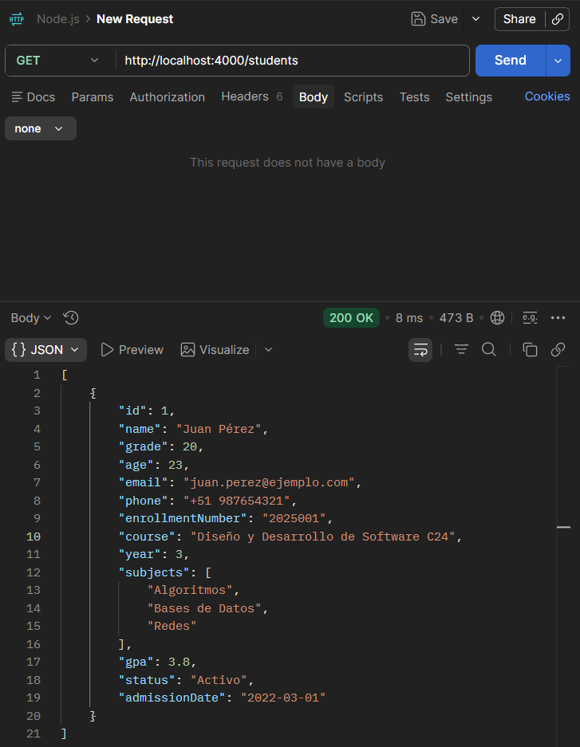
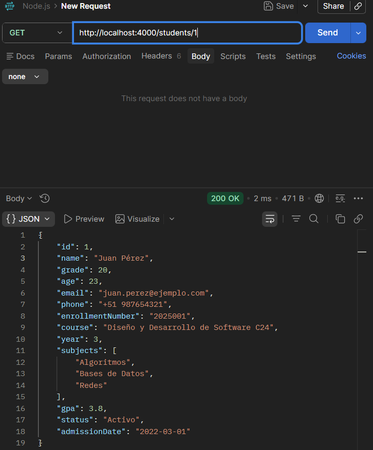
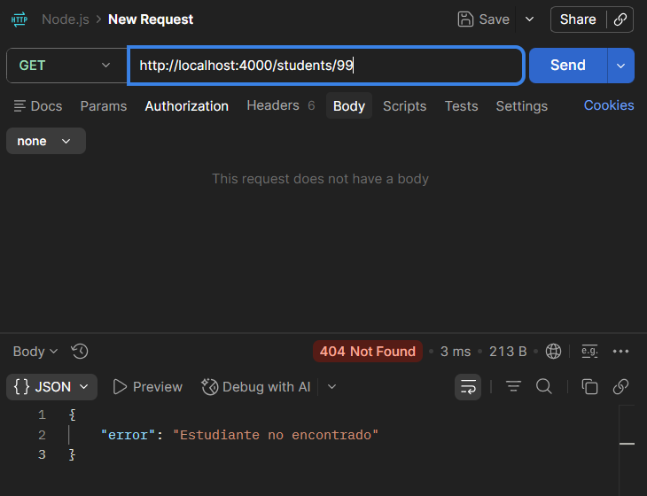
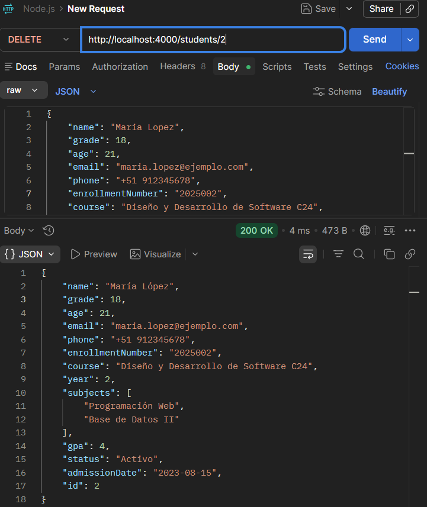
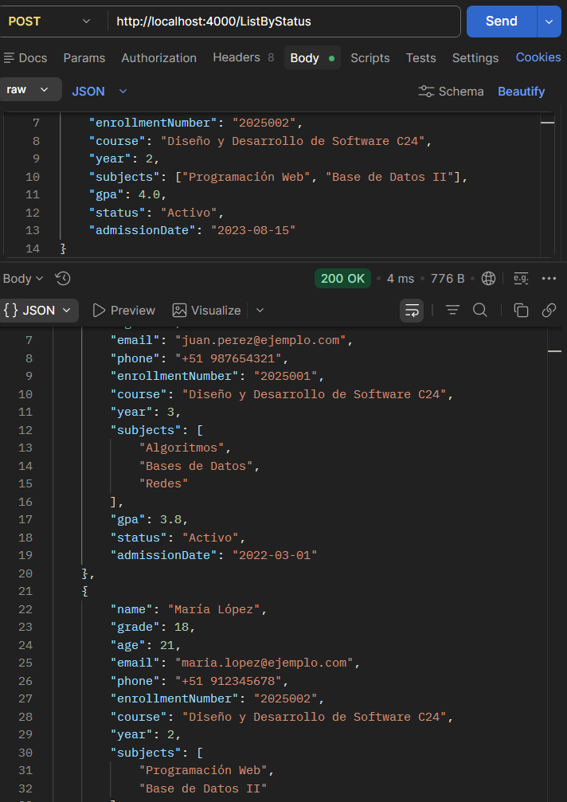
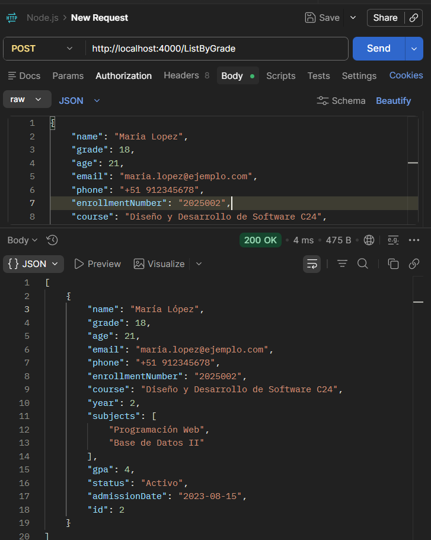

# DesarrolloAplicacionesAvanzado
# SEMANA 02 - Ejercicios 03
# 📚 Student API - Node.js Vanilla

Proyecto de API REST básica usando Node.js sin frameworks.

---

## 🚀 Tecnologías usadas
- Node.js
- HTTP Module
- JavaScript (ES6)
- JSON API

---

## 📦 Estructura del proyecto

---

## 🧪 Pruebas realizadas en Postman - Ejercicios03 (Student API)

**Base URL:** `http://localhost:4000` · **Header en POST/PUT:** `Content-Type: application/json`

> Ejecutar servidor: `node SEMANA02/Ejercicios03/main.js`

| # | Endpoint | Descripción |
|---|----------|-------------|
| 1️⃣ | `GET /students` | Lista todos los estudiantes |
| 2️⃣ | `GET /students/:id` | Obtiene un estudiante; `404` si no existe |
| 3️⃣ | `POST /students` | Crea un estudiante; valida `name`, `email`, `course`, `phone` |
| 4️⃣ | `PUT /students/:id` | Actualiza campos (el `id` no se puede modificar) |
| 5️⃣ | `DELETE /students/:id` | Elimina un estudiante por id |
| 6️⃣ | `POST /ListByStatus` | Filtra por `status` exacto |
| 7️⃣ | `POST /ListByGrade` | Filtra estudiantes con `gpa >=` valor enviado |
| 8️⃣ | Ruta no definida | Responde `404 { "error": "Ruta no encontrada" }` |

**Evidencias (Postman):**

| GET `/students` | GET `/students/1` (éxito) | GET `/students/99` (404) |
|:---:|:---:|:---:|
|  |  |  |

| POST `/students` (éxito) | POST falta `name` | POST falta `email` |
|:---:|:---:|:---:|
|  |  |  |

| DELETE `/students/:id` | POST `/ListByStatus` | POST `/ListByGrade` |
|:---:|:---:|:---:|
|  |  |  |
