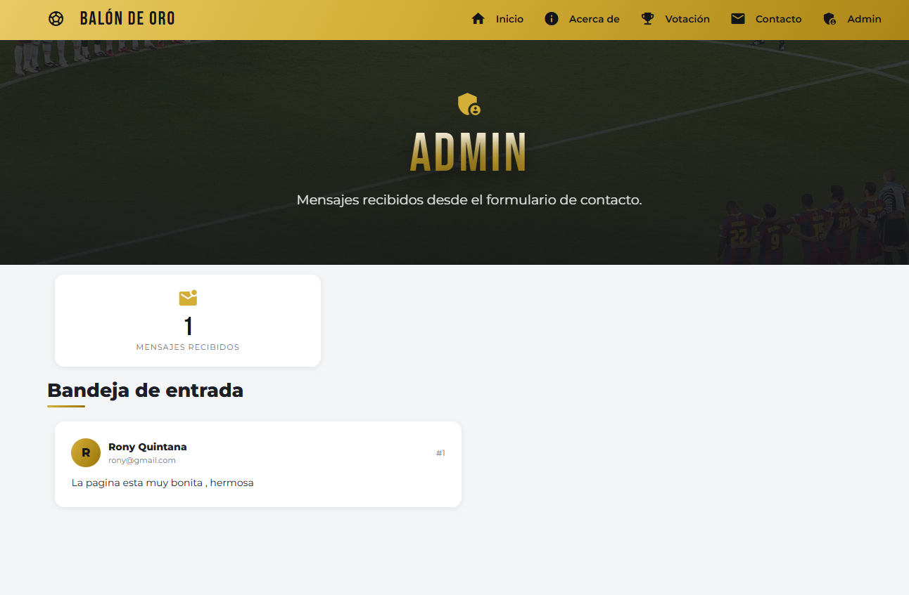

# Balón de Oro — Mi Sitio Express

Sitio web construido con **Node.js + Express + EJS + Materialize (Material Design)** para el curso de
**Desarrollo de Aplicaciones Web Avanzado** (Semana 04).

La temática del proyecto es la gran duda que se repite cada año en el fútbol: **¿quién ganará el Balón de Oro?**
El sitio incluye una encuesta funcional donde los visitantes votan por su candidato y las estadísticas
se actualizan en tiempo real.

---

## Vista general


Banner a pantalla completa (`100vh`) con fotografías reales de estadios que se alternan en un carrusel
automático cada 6 segundos, sobre una capa de color sólido. El título aparece **letra por letra** con
animación escalonada y degradado dorado.

---

## Sistema de votación


La sección de votación tiene dos columnas:

**Formulario (izquierda)** — dividido en 3 pasos numerados:
1. **Elige a tu candidato** — cada jugador se muestra como tarjeta con su **foto real y la bandera de su país**.
   Al seleccionar uno, aparece un panel con su nombre, foto, equipo y bandera.
2. **Tus datos** — nombre del votante y país desde donde vota.
3. **¿Por qué lo eliges?** — motivo principal, nivel de confianza (slider 0–100%) y comentario opcional.

**Estadísticas (derecha)**:
- **Ranking en vivo** — posición, foto, bandera, porcentaje y barra que se llena con animación.
- **¿Por qué votan?** — desglose de los motivos declarados por los votantes.

---

## Historial de votos


Cada voto registrado queda en una tabla con votante, país, candidato (con foto y bandera), motivo,
nivel de confianza y fecha. Si el votante dejó un comentario, aparece debajo de su fila.

---

## Acerca de


Cada ruta tiene su propia cabecera con un estadio diferente de fondo y el título animado letra por letra.

---

## Panel de administración



Muestra los mensajes recibidos desde el formulario de contacto, con contador animado y tarjetas
con avatar generado a partir de la inicial del remitente.

---

## Rutas

| Método | Ruta             | Descripción                                            |
|--------|------------------|--------------------------------------------------------|
| GET    | `/`              | Inicio con banner a pantalla completa                  |
| GET    | `/about`         | Información del proyecto y tecnologías                 |
| GET    | `/balon-de-oro`  | Encuesta: formulario + estadísticas + historial        |
| POST   | `/balon-de-oro`  | Registra un voto y redirige a la encuesta              |
| GET    | `/contact`       | Formulario de contacto                                 |
| POST   | `/contact`       | Guarda el mensaje y redirige a `/admin`                |
| GET    | `/admin`         | Bandeja de mensajes recibidos                          |
| —      | *(cualquier otra)* | Página **404** personalizada                         |

---

## Estructura del proyecto

```
mi-sitio-express/
├── app.js                          # Configuración de Express, middlewares y 404
├── controllers/
│   ├── mainController.js           # Inicio, acerca de, contacto y admin
│   └── ballonDorController.js      # Candidatos, votos y estadísticas
├── routes/
│   ├── mainRoutes.js
│   └── ballonDorRoutes.js
├── views/
│   ├── partials/
│   │   ├── header.ejs              # Navbar dorado + <head>
│   │   ├── footer.ejs              # Footer dorado + scripts de animación
│   │   └── pageHero.ejs            # Cabecera reutilizable con título animado
│   ├── home.ejs
│   ├── about.ejs
│   ├── ballonDeOro.ejs
│   ├── contact.ejs
│   ├── admin.ejs
│   └── notFound.ejs                # Error 404 personalizado
├── public/
│   ├── styles.css                  # Tema dorado y todas las animaciones
│   ├── images/
│   │   ├── players/                # Fotos de los 6 candidatos
│   │   ├── flags/                  # Banderas SVG
│   │   └── hero/                   # Fondos de estadios
│   └── vendor/materialize/         # Materialize CSS y JS auto-alojados
└── Docs/                           # Capturas de pantalla del proyecto
```

---

## Almacenamiento en memoria

Los datos viven en el servidor mientras el proceso esté activo (no hay base de datos).

**Candidatos** — 6 jugadores con 8 campos cada uno:

```js
{ id, name, team, country, flag, photo, position, age }
```

**Votos** — cada registro guarda 7 campos:

```js
{ voterName, voterCountry, candidateId, reason, confidence, comment, votedAt }
```

El ranking no guarda contadores duplicados: los porcentajes se calculan a partir del array de votos,
así que las estadísticas nunca se desincronizan.

**Mensajes de contacto** — `{ name, email, mensaje }`.

---

## Diseño y animaciones

- **Color principal dorado** aplicado a navbar, footer, botones, barras y acentos.
- **Tipografías**: `Bebas Neue` para títulos y `Montserrat` para el texto.
- **Títulos letra por letra**: cada carácter cae con `animation-delay` escalonado y degradado dorado.
- **Descripciones palabra por palabra**: cada palabra entra con desenfoque que se desvanece.
- **Barras de estadísticas animadas**: crecen desde 0% hasta su valor real al cargar.
- **Contadores ascendentes** con `requestAnimationFrame` en las tarjetas de resumen.
- **Aparición al hacer scroll** con `IntersectionObserver`.
- **Sombreado y elevación** en todas las tarjetas al pasar el mouse.
- Se respeta `prefers-reduced-motion` para usuarios que prefieren menos movimiento.

---

## Instalación y ejecución

```bash
npm install express ejs materialize-css
npm start
```

El servidor queda disponible en `http://localhost:3000`.

---

## Créditos de las imágenes

Todas las fotografías están **auto-alojadas** en `public/images/` y provienen de
**Wikimedia Commons** bajo licencias libres (Creative Commons / dominio público):

- **Jugadores** — obtenidas mediante la API de Wikipedia, que solo admite imágenes con licencia libre
  en las fichas de personas vivas.
- **Banderas** — SVG oficiales de Francia, España, Brasil y Noruega.
- **Estadios** — Camp Nou, Allianz Arena, Maracaná y un estadio nocturno.

---

## Autor

**Rony Quintana** — Tecsup, Desarrollo de Aplicaciones Web Avanzado, 2026.
